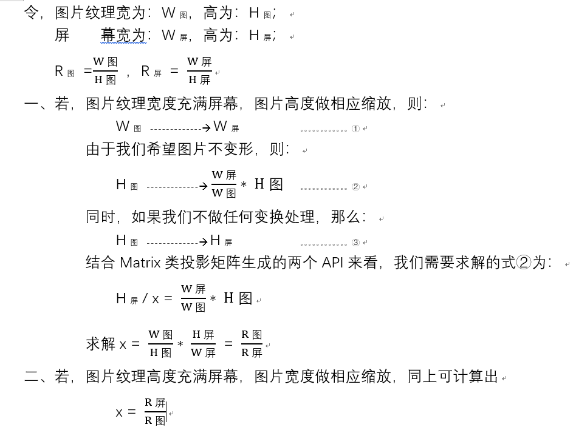

## 说明

这是一个从零开始学习Android OpenGL ES2.0的Demo程序。主要参考CSDN上`湖广午王`的[Android OpenGL ES专栏](https://blog.csdn.net/junzia/column/info/15997)系列博文,该专栏全部代码托管在[Github](https://github.com/doggycoder/AndroidOpenGLDemo)上。专栏中的每一篇专栏的博文对应本Demo程序的一个Android Library。当然Demo中也会参考到其他资料，比较好的资料会给出相关链接。

### 当前内容

1. test1 三角形
  参考资料：
    - 专栏博文 [Android OpenGLES2.0（二）——绘制一个三角形](https://blog.csdn.net/junzia/article/details/52801772)
2. test2 等腰直角三角形和彩色的三角形
  参考资料：
    - 专栏博文 [Android OpenGLES2.0（三）——等腰直角三角形和彩色的三角形](https://blog.csdn.net/junzia/article/details/52817978)  
    - [Learn OpenGL CN 坐标系统](https://learnopengl-cn.github.io/01%20Getting%20started/08%20Coordinate%20Systems/)
    - [OpenGL 学习系列---坐标系统](https://juejin.im/post/5b07fd74f265da0dca10a0c2)
    - [OpenGL 学习系列---投影矩阵](https://juejin.im/post/5b0ec5fef265da092a2b79b1)
    - [OpenGL 学习系列---观察矩阵](https://juejin.im/post/5b13fdc4e51d45069a39e3c6)
3. test3 正方形和圆形  
  参考资料：
    - 专栏博文 [Android OpenGLES2.0（四）——正方形和圆形](https://blog.csdn.net/junzia/article/details/52818488)
4. test4 立方体
  参考资料： 
    - 专栏博文 [Android OpenGLES2.0（五）——绘制立方体](https://blog.csdn.net/junzia/article/details/52820177)
    - [《OpenGL 学习系列---观察矩阵》](https://glumes.com/post/opengl/opengl-tutorial-view-matrix/)#确定相机位置：解释了设置观察矩阵时up参数的意义
5. test5 圆锥、圆柱和球体
  参考资料：
    - 专栏博文 [Android OpenGLES2.0（六）——构建圆锥、圆柱和球体](https://blog.csdn.net/junzia/article/details/52826856)
    - 《OpenGL ES应用开发实践指南 Android卷》第8章第8.6小节：关于模型矩阵、视图矩阵、**投影矩阵**
6. test6 2D纹理贴图
  参考资料：
    - 专栏博文 [Android OpenGLES2.0（八）——纹理贴图之显示图片](https://blog.csdn.net/junzia/article/details/52842816)
    - 《OpenGL ES应用开发实践指南 Android卷》第7章：绘制纹理的流程和代码细节
    - [Android OpenGL 纹理坐标原点位置](https://www.jianshu.com/p/6c4c7426eef3)：探究Android中OpenGL ES纹理坐标原点
    - 纹理贴图投影矩阵参数计算总结：
7. test7 处理图片(图片滤镜)
  参考资料：
    - 专栏博文 [Android OpenGLES2.0（九）——利用OpenGL进行图片处理](https://blog.csdn.net/junzia/article/details/52902189)
    - 图像黑白滤镜参数来自著名的色彩心理学公式：Gray = R*0.299 + G*0.587 + B*0.114  
8. test8 使用矩阵完成OpenGL中的平移、旋转、缩放
  参考资料：
    - 专栏博文 [Android OpenGLES2.0（十）——OpenGL中的平移、旋转、缩放](https://blog.csdn.net/junzia/article/details/53154175)
    - 使用模型矩阵将坐标变换到世界空间时，注意矩阵的乘法顺序（与通常我们思考的顺序相反）。
9. test9 使用OpenGLES做Camera预览
  参考资料：
    - 专栏博文 [Android OpenGLES2.0（十一）——利用OpenGLES做Camera预览](https://blog.csdn.net/junzia/article/details/53166332)
10. test10 FBO离屏渲染
  参考资料： 
    - 专栏博文 [FBO离屏渲染](https://blog.csdn.net/junzia/article/details/53861519)
    - 关于帧缓冲、渲染缓冲等概念、作用详解：[高级OpenGL-05.帧缓冲（Framebuffers）](https://www.jianshu.com/p/29a7dde7d21f)
11. to be continue